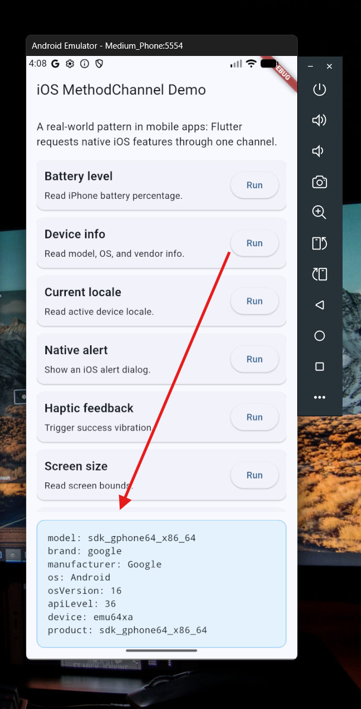
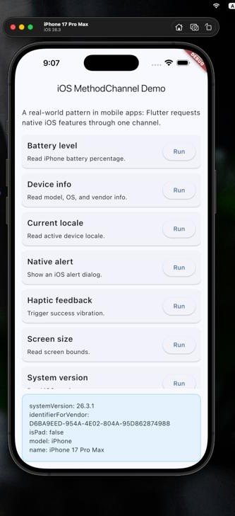

# Flutter MethodChannel – Android & iOS Examples

A hands-on, real-world demo of the **Flutter MethodChannel**: the pattern used when a Flutter app needs to call **native** code (Android/Kotlin and iOS/Swift) and read the result back.

This repo is a single app with a scrollable list of **60+ native features**. Every row is a MethodChannel call to the platform side, so you can tap through real device APIs (battery, torch, haptics, maps, notifications, sensors, and much more) on both **Android** and **iOS**.

---

## Table of Contents

- [Test results](#test-results)
- [What is a MethodChannel?](#what-is-a-methodchannel)
- [Project structure](#project-structure)
- [Example list (what's inside)](#example-list-whats-inside)
- [Prerequisites](#prerequisites)
- [Setup & run](#setup--run)
  - [Run on Android](#run-on-android)
  - [Run on iOS](#run-on-ios)
- [How it works (code walkthrough)](#how-it-works-code-walkthrough)
- [Platform notes & permission](#platform-notes--permissions)
- [Need help](#need-help)

---

## Test results

Both platforms verified on real emulators/simulators — Dart → native → Dart round trip works end to end.

<table>
<tr>
<td align="center" width="50%">
<b>Android</b> (Medium_Phone API 36 emulator)<br/>
<code>getDeviceInfo</code> result
<br/><br/>

</td>
<td align="center" width="50%">
<b>iOS</b> (iPhone 17 Pro Max simulator)<br/>
<code>getSystemVersion</code> result
<br/><br/>

</td>
</tr>
</table>

---

## What is a MethodChannel?

Flutter runs its UI in Dart, but some features only exist in the **native OS** (e.g. battery level, haptic vibration, the system flashlight, opening Apple Maps / Google Maps, showing a local notification).

A **MethodChannel** is the official, built-in bridge that lets Dart and native code talk to each other:

```
Dart (Flutter)  ──invokeMethod("getBatteryLevel")──▶  Native (Kotlin / Swift)
     ◀─────────────── result (e.g. 78) ──────────────
```

Both sides agree on:
1. **A channel name** — e.g. `com.example.methodchannel_demo` (must match exactly on both sides).
2. **A method name** — e.g. `getBatteryLevel`.
3. **An optional argument map** and **a return value**.

This is the same mechanism that powers almost every official Flutter plugin, so understanding it makes reading plugin source much easier.

---

## Project structure

| Path | What it is |
|------|-----------|
| `lib/main.dart` | **The Flutter (Dart) side.** Defines the single channel `com.example.methodchannel_demo`, the full list of examples, and calls `invokeMethod(...)` for each one. This file is shared by **both** platforms. |
| `android/app/src/main/kotlin/com/example/method_channel_test/MainActivity.kt` | **Android native handler.** Registers the same channel (`configureFlutterEngine`) and implements every method in Kotlin. |
| `android/app/src/main/AndroidManifest.xml` | Android permissions required by the native code (network, vibrate, camera/flash, notifications, biometric). |
| `ios/Runner/AppDelegate.swift` | **iOS native handler.** Where the same channel is registered and the methods are implemented in Swift. |

> The channel name must be **identical** in `main.dart`, `MainActivity.kt`, and `AppDelegate.swift`, otherwise calls fail silently / with a `MissingPluginException`.

---

## Example list (what's inside)

Every item below is a working example you can tap. The **method** column is the exact string sent over the channel.

| # | Title | Method | Platform |
|---|-------|--------|----------|
| 1 | Battery level | `getBatteryLevel` | both |
| 2 | Device info | `getDeviceInfo` | both |
| 3 | Current locale | `getLocale` | both |
| 4 | Native alert | `showAlert` | both |
| 5 | Haptic feedback | `triggerHapticFeedback` | both |
| 6 | Screen size | `getScreenSize` | both |
| 7 | System version | `getSystemVersion` | both |
| 8 | App name | `getAppName` | both |
| 9 | Bundle / package ID | `getBundleId` | both |
| 10 | App version | `getAppVersion` | both |
| 11 | Build number | `getBuildNumber` | both |
| 12 | Time zone | `getTimeZone` | both |
| 13 | Current time | `getCurrentTime` | both |
| 14 | Date format | `getDateFormat` | both |
| 15 | Clipboard text | `getClipboardText` | both |
| 16 | Copy to clipboard | `copyToClipboard` | both |
| 17 | Share sheet | `shareText` | both |
| 18 | Open URL (browser) | `openUrl` | both |
| 19 | Open settings | `openSettings` | both |
| 20 | Open maps | `openMaps` | both |
| 21 | Call phone | `openDialer` | both |
| 22 | Send email | `openMail` | both |
| 23 | Network status | `getNetworkStatus` | both |
| 24 | Airplane mode | `isAirplaneModeEnabled` | both |
| 25 | Charging state | `isCharging` | both |
| 26 | Dark mode | `isDarkMode` | both |
| 27 | Face ID / face biometrics | `isFaceIDAvailable` | both |
| 28 | Touch ID / fingerprint | `isTouchIDAvailable` | both |
| 29 | Low power mode | `isLowPowerModeEnabled` | both |
| 30 | Proximity sensor | `getProximityState` | both |
| 31 | Screen brightness | `getBrightness` | both |
| 32 | Set brightness | `setBrightness` | both |
| 33 | Vibration – light | `vibrateLight` | both |
| 34 | Vibration – medium | `vibrateMedium` | both |
| 35 | Vibration – heavy | `vibrateHeavy` | both |
| 36 | Notification sound | `playNotificationSound` | both |
| 37 | Impact sound | `playImpactSound` | both |
| 38 | Flashlight toggle | `toggleTorch` | both |
| 39 | Torch status | `getTorchStatus` | both |
| 40 | Device ID | `getDeviceId` | both |
| 41 | Vendor ID | `getVendorId` | both |
| 42 | Disk usage | `getDiskUsage` | both |
| 43 | Free storage | `getFreeStorage` | both |
| 44 | Memory usage | `getMemoryUsage` | both |
| 45 | CPU usage | `getCPUUsage` | both |
| 46 | Uptime | `getUptime` | both |
| 47 | Available locales | `getAvailableLocales` | both |
| 48 | Status bar height | `getStatusBarHeight` | both |
| 49 | Keyboard height | `getKeyboardHeight` | both |
| 50 | Badge count | `getBadgeCount` | both |
| 51 | Set badge | `setBadge` | both |
| 52 | Clear badge | `clearBadge` | both |
| 53 | Is simulator/emulator | `isSimulator` | both |
| 54 | Orientation | `getOrientation` | both |
| 55 | Language code | `getLanguageCode` | both |
| 56 | Country code | `getCountryCode` | both |
| 57 | UUID | `generateUuid` | both |
| 58 | Random number | `generateRandomNumber` | both |
| 59 | Action sheet | `showActionSheet` | both |
| 60 | Local notification | `scheduleLocalNotification` | both |
| 61 | Notification permission | `getNotificationPermissionStatus` | both |
| 62 | Request permission | `requestNotificationPermission` | both |
| 63 | Sound toggle | `toggleSound` | both |
| 64 | Volume level | `getVolumeLevel` | both |

---

## Prerequisites

- [Flutter SDK](https://docs.flutter.dev/get-started/install) (3.x or newer) installed and on your `PATH`.
- For **Android**: Android Studio + an Android SDK, and a connected device or emulator.
- For **iOS**: a Mac with Xcode and a simulator/device (iOS development only works on macOS).

Set up your environment and confirm with:

```bash
flutter doctor
```

---

## Setup & run

```bash
# 1. Get a copy of the repo and install Dart dependencies
git clone <your-repo-url>
cd method_channel_test
flutter pub get
```

### Run on Android

```bash
# with a device/emulator connected
flutter run -d <android-device-id>

# or just:
flutter run
```

> On a real phone, Android will ask for camera / notification permission the first time you use the flashlight or notification examples. On an emulator there is usually no flashlight sensor, so those rows return a "no flash" message.

### Run on iOS

```bash
flutter run -d <ios-device-id>    # e.g. an iPhone simulator
```

> Some iOS examples (Face ID, real haptics, flashlight, `isSimulator`) behave differently on a Simulator vs. a physical device — a real iPhone gives the most accurate results.

---

## How it works (code walkthrough)

### 1. Dart side — `lib/main.dart`

Create the channel with a fixed name, then call native methods by name:

```dart
static const MethodChannel _channel = MethodChannel('com.example.methodchannel_demo');

final dynamic result = await _channel.invokeMethod(
  'getBatteryLevel',   // method name
  null,                // optional arguments
);
```

### 2. Android side — `MainActivity.kt`

Register the same channel and handle the call in a `when` block:

```kotlin
override fun configureFlutterEngine(flutterEngine: FlutterEngine) {
    super.configureFlutterEngine(flutterEngine)
    MethodChannel(flutterEngine.dartExecutor.binaryMessenger, "com.example.methodchannel_demo")
        .setMethodCallHandler { call, result ->
            when (call.method) {
                "getBatteryLevel" -> result.success(getBatteryLevel())
                // ... all other methods
                else -> result.notImplemented()
            }
        }
}
```

### 3. iOS side — `AppDelegate.swift` (same idea, Swift)

Register the channel once and switch on `call.method`, replying with `result(...)`:

```swift
let controller = window?.rootViewController as! FlutterViewController
let channel = FlutterMethodChannel(name: "com.example.methodchannel_demo",
                                   binaryMessenger: controller.binaryMessenger)
channel.setMethodCallHandler { (call, result) in
    switch call.method {
    case "getBatteryLevel":
        result(UIDevice.current.batteryLevel)
    default:
        result(FlutterMethodNotImplemented)
    }
}
```

**Golden rule:** the channel name and the list of method names must match on all three sides.

---

## Platform notes & permissions

Because Android and iOS expose the OS differently, a few examples are best-effort equivalents:

| Feature | Android behavior | iOS behavior |
|---------|------------------|--------------|
| Badge count / set / clear badge | Not a universal API → returns `0` / no-op | Uses `UIApplication.applicationIconBadgeNumber` |
| `isSimulator` | Always `false` (no standard check) | Uses `TARGET_OS_SIMULATOR` |
| Keyboard height | No public API → returns `0` | Estimates via `UIWindow` keyboard frame |
| Proximity sensor | `SensorManager.TYPE_PROXIMITY` | `UIDevice.proximityState` |
| Flashlight | `CameraManager.setTorchMode` (needs CAMERA permission) | `AVCaptureDevice` torchness |
| Local notification | `NotificationChannel` + POST_NOTIFICATIONS (Android 13+) | `UNUserNotificationCenter` |

**Android permissions** already declared in `AndroidManifest.xml`:
`INTERNET`, `ACCESS_NETWORK_STATE`, `VIBRATE`, `CAMERA`, `FLASHLIGHT`, `POST_NOTIFICATIONS`, `USE_BIOMETRIC`, `USE_FINGERPRINT`, `BATTERY_STATS`.

---

## Need help

Open an issue in this repo, or check the official docs:

- [Flutter platform channels](https://docs.flutter.dev/platform-integration/platform-channels)
- [Android MethodChannel (Kotlin)](https://docs.flutter.dev/platform-integration/android/platform-channels)
- [iOS MethodChannel (Swift)](https://docs.flutter.dev/platform-integration/ios/platform-channels)
